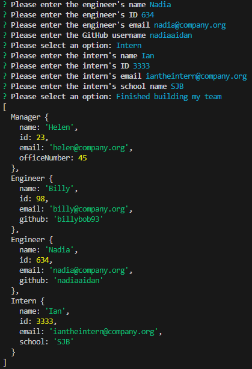
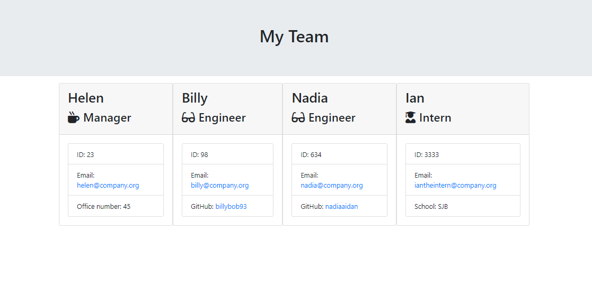

# Team Profile Generator

## Description

My aim with this project was to create a command line application which allows the user to input the details of their team and generate a HTML file with that same information. I used ES6 class properties and methods to create a new team and employees. I used subclasses to create different types of employees, i.e. manager, engineer(s) and intern(s).

I was able to use RegEx to validate the user's input for certain questions. For example, ensuring that the names contained letters only, ID numbers contain numbers only, and to ensure that email addresses are in the correct format.

This project also allowed me to get used to working with tests, ensuring that my code meets the test criteria and checking that my code is functioning in order to ultimately create a HTML file with the team's details.

## Usage

Type 'node index.js' into your command line.

You will then be prompted to enter the Manager's name, ID number, email and office number.

You can then choose to add a new Enginner or Intern, or confirm that you have finished building your team.

If you want to add an Engineer, you will be asked to input their name, ID number, email and GitHub username.

If you want to add an Intern, you will be asked to input their name, ID number, email and school name.

Please note that validation has been added to ensure that the format is in the correct format. For example, you will not be able to move onto the next question if an email address has not been correctly formatted, i.e. with an '@' symbol and full stop.

You can create as many employees as you wish. Once you have finished, select "Finished building my team", and a HTML file will be created in the output folder containing your team's information.

Please take a look below at some screenshots and video to see how it works:

https://github.com/EleniMG/Team-Profile-Generator/assets/112894341/149092dd-b59a-4b9e-ad52-068d89b83c4c

## Credits

The following third-party assets were used to assist with this code:

[typeof - MDN](https://developer.mozilla.org/en-US/docs/Web/JavaScript/Reference/Operators/typeof)

[inquirer - npm](https://www.npmjs.com/package/inquirer?activeTab=readme)
